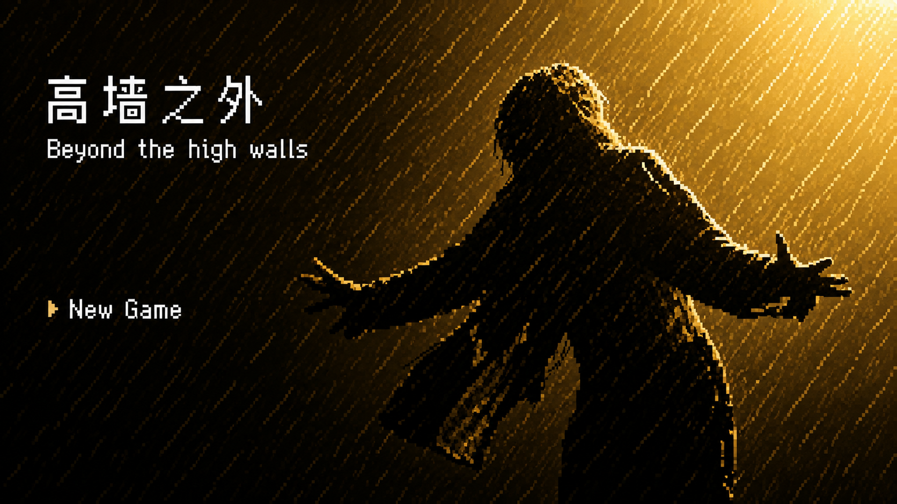

# Beyond The Walls 高墙之外

## 项目简介

**Beyond The Walls** 是一款基于 HTML5 开发的像素风剧情冒险小游戏。游戏以经典越狱叙事为灵感，玩家将从现实中的客厅观影场景出发，在电视白光的牵引下进入电影世界，化身囚犯安迪，在压抑的监狱环境中一步步完成逃脱计划。

游戏采用“幕式剧情推进”的方式，将剧情探索、道具收集、场景交互、失败回退、节奏操作和多结局选择结合起来，让玩家在短流程中体验从绝望到希望、从囚禁到自由的过程。

## 游戏特色

-   **像素风视觉表现**：使用复古像素画面营造监狱氛围。
    
-   **剧情驱动体验**：玩家不只是观看故事，而是亲自参与安迪的逃脱计划。
    
-   **多阶段主线流程**：包含客厅观影、白光转场、牢房探索、劳作区互动、挖洞、撒土、办公室调包、水管逃脱等环节。
    
-   **道具与任务系统**：玩家需要获取石锤、圣经、地图、账本等关键道具推动剧情发展。
    
-   **失败回退机制**：查房失败、撒土被发现、水管操作失误等情况都会触发失败并回到检查点。
    
-   **雷雨夜节奏玩法**：最终逃脱阶段需要在雷声窗口中完成水管砸击操作。
    
-   **三结局设计**：游戏结尾提供不同结局入口，增强故事的完整性和可玩性。
    
-   **支持电脑与移动端**：画布自适应 16:9 屏幕比例，适合网页端直接体验。
    

## 游戏流程

大致流程如下：

```text
开始界面
↓
现实客厅观影
↓
剧情回顾与白光转场
↓
牢房醒来
↓
劳作区寻找瑞德与老布
↓
获得石锤和圣经
↓
通过典狱长查房
↓
第一次挖洞
↓
劳作区撒土
↓
二十年蒙太奇
↓
绘制地图并进入典狱长办公室
↓
寻找刺绣后的账本并完成调包
↓
最终土洞
↓
雷雨夜水管逃脱
↓
三结局选择

```

## 操作方式

### 电脑端

-   `W / A / S / D` 或方向键：移动角色
    
-   `E` / 空格：交互、推进对话或剧情
    
-   鼠标点击：部分界面交互
    
-   连续按三次 `6`：打开开发者进度工具
    

### 移动端

-   使用屏幕虚拟摇杆控制移动
    
-   使用屏幕交互按钮完成对话、调查、挖洞、撒土、砸水管等操作
    

## 运行方式

本项目为纯前端网页小游戏，无需后端环境。

### 方法一：直接打开

下载项目后，直接打开：

```text
index.html

```

即可进入游戏。

### 方法二：使用本地服务器运行

也可以使用 VS Code 的 Live Server 插件，或者使用本地静态服务器运行项目。

例如：

```bash
python -m http.server 8000

```

然后在浏览器中打开：

```text
http://localhost:8000

```

## 项目结构

```text
Shawshank Pixel Escape/
├── index.html              # 游戏入口页面
├── js/
│   └── main.js             # 游戏主要逻辑
├── images/                 # 游戏图片素材
├── audio/                  # 游戏音频素材
├── 三个结局/               # 三个结局页面
└── README.md               # 项目说明文档

```

## 技术栈

-   HTML5
    
-   CSS3
    
-   JavaScript
    
-   Canvas 2D
    
-   本地静态资源加载
    
-   响应式画布适配
    

## 开发者工具

游戏内置了开发者进度工具，方便测试不同剧情节点和检查点。

打开方式：

```text
连续按三次 6

```

开发者工具支持：

-   快速切换主线进度
    
-   传送到关键交互点
    
-   修改游戏状态旗标
    
-   保存检查点
    
-   运行调试脚本
    
-   查看当前场景、任务、角色位置和道具状态
    

该工具主要用于开发调试，正式展示时可以隐藏或不主动说明。

## 当前完成内容

-   游戏开始界面
    
-   客厅观影与白光转场
    
-   牢房探索
    
-   劳作区 NPC 互动
    
-   石锤与圣经道具获取
    
-   典狱长查房逻辑
    
-   挖洞玩法
    
-   撒土玩法
    
-   二十年蒙太奇
    
-   地图绘制
    
-   典狱长办公室探索
    
-   账本调包
    
-   最终水管逃脱
    
-   三结局入口
    
-   开发者调试工具
    
## 项目说明

本项目为比赛展示的互动叙事小游戏 Demo，重点展示 HTML5 Canvas 游戏开发、剧情流程设计、像素风视觉表达和网页端交互体验。


