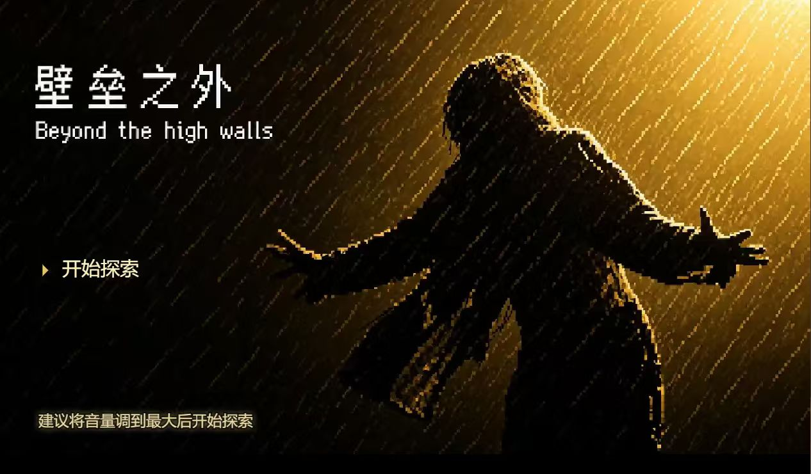
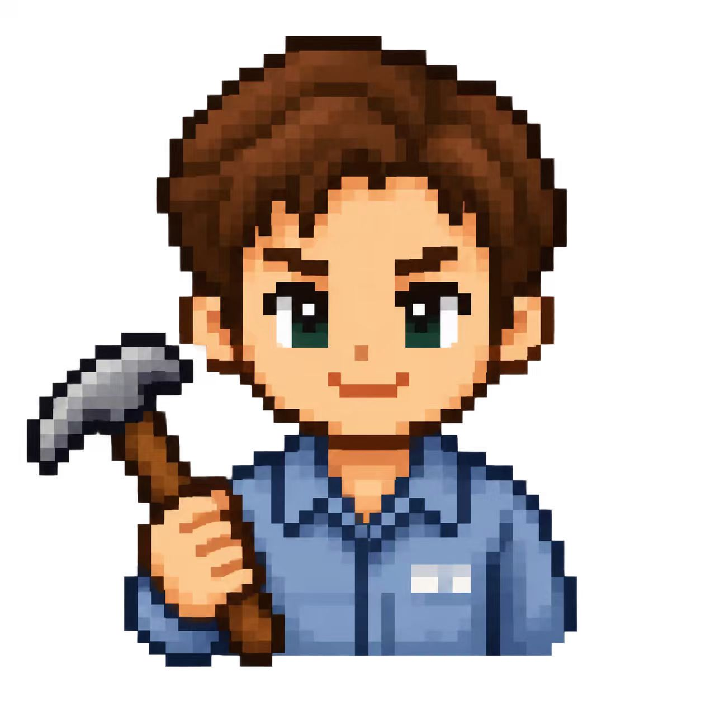

[README.md](https://github.com/user-attachments/files/31170301/README.md)
# Beyond The Walls｜高墙之外

<p align="center">
  <strong>一款将经典越狱叙事转化为可交互体验的 2D 像素剧情冒险游戏</strong>
</p>

<p align="center">
  网页版体验链接：www.liyixiong.cn/game
</p>

<p align="center">
  HTML5 · CSS3 · JavaScript · Canvas 2D · Web Game
</p>

<p align="center">
  
</p>

---

## 🎬 项目简介

**Beyond The Walls（高墙之外）** 是一款以监狱逃脱与互动叙事为核心的 2D 像素剧情冒险游戏。

玩家不再只是旁观一段越狱故事，而是进入高墙之内，亲自探索监狱、与 NPC 交互、寻找关键道具、完成任务，并在漫长的准备与风险判断中一步步接近自由。

我们希望把电影式的叙事转化成真正可以由玩家完成的行为：

**寻找、选择、隐藏、等待、冒险与逃离。**

---

## 🧑‍🎮 主角

<p align="center">
  
</p>

<p align="center">
  <em>在高墙之内寻找机会，在漫长等待中为自由做准备。</em>
</p>

---

## ✨ 游戏特色

- 🎭 **剧情驱动的沉浸式体验**  
  通过场景、角色与任务推进完整的越狱故事。

- 🗺️ **自由探索**  
  玩家可以在监狱不同区域中移动，寻找人物、道具与隐藏内容。

- 🤝 **NPC 互动与信任机制**  
  与监狱中的角色建立关系，通过互动推进任务。

- 🧰 **道具与任务系统**  
  收集关键物品，为逃脱进行长期准备。

- ⚠️ **风险与失败机制**  
  部分关键剧情存在失败条件，玩家需要在有限机会中完成任务。

- 🌧️ **环境节奏玩法**  
  在逃脱阶段利用雷雨、声音与环境掩护完成关键操作。

- 🎬 **多结局设计**  
  游戏最终将根据玩家选择进入不同的故事结局。

- 🕹️ **网页端运行**  
  无需安装大型游戏引擎，直接通过浏览器即可运行。

---

## 🎮 游戏流程

```text
进入故事
   ↓
熟悉监狱环境
   ↓
寻找 NPC 与关键线索
   ↓
建立信任并获得关键道具
   ↓
完成逃脱准备
   ↓
应对检查与风险事件
   ↓
执行最终逃脱计划
   ↓
进入不同结局
```

游戏并不是单纯通过文字推进剧情。

玩家需要亲自完成探索、寻找、交互、隐藏、任务和逃脱等操作，让故事中的关键事件真正成为“游戏过程”。

---

## 🕹️ 操作方式

### PC

| 操作 | 按键 |
|---|---|
| 移动角色 | `W` `A` `S` `D` / 方向键 |
| 交互 / 推进剧情 | `E` / `Space` |
| 菜单与界面操作 | 鼠标 |

### 移动端

移动端通过屏幕虚拟控制区域完成角色移动，并通过交互按钮完成：

- 对话
- 调查
- 道具操作
- 剧情推进
- 特殊任务

---

## 🚀 如何运行

克隆仓库：

```bash
git clone https://github.com/SSxs-wym/Beyond-The-Walls-.git
```

进入项目：

```bash
cd Beyond-The-Walls-
```

游戏主体目前位于：

```text
高墙之外/
```

进入该目录后，通过项目中的网页入口运行游戏。

如果直接打开 HTML 时出现图片、音频等资源无法加载的问题，建议使用 VS Code 的 **Live Server** 启动本地静态服务器。

---

## 📁 项目结构

```text
Beyond-The-Walls-/
│
├── 高墙之外/
│   ├── 游戏代码
│   ├── 场景资源
│   ├── 图片资源
│   ├── 音效资源
│   └── 开发及测试文件
│
├── docs/
│   └── readme/
│       ├── cover.jpg
│       └── character.jpg
│
└── README.md
```

其中：

- `高墙之外/`：游戏主体
- `docs/readme/`：README 展示图片
- `README.md`：GitHub 项目首页

---

## 🛠️ 技术实现

项目主要围绕以下技术实现：

- **HTML5**
- **CSS3**
- **JavaScript**
- **Canvas 2D**
- **网页游戏交互**
- **NPC 与任务状态管理**
- **本地图片与音效资源加载**
- **2D 像素场景**
- **桌面端 / 移动端适配**

整个项目无需 Unity 等大型游戏引擎即可运行。

---

## 💡 设计理念

《高墙之外》的核心并不是简单复刻一个越狱故事。

我们更希望回答一个问题：

> **如果玩家不再只是旁观一个人逃离高墙，而是必须亲自完成那些漫长、危险又充满希望的步骤，会产生怎样不同的体验？**

因此，我们尝试把剧情中的事件转换成真正的玩家行为。

**探索**代表寻找机会。  
**道具**代表漫长的准备。  
**失败机制**代表逃脱过程中的风险。  
**环境与时机**代表最后阶段的判断。  

而最终的自由，不再只是故事中的一个结局。

它成为玩家亲手完成的结果。

---

## 🧩 后续计划

- [ ] 优化角色移动与碰撞体验
- [ ] 完善 NPC 对话与信任系统
- [ ] 优化监狱地图与场景细节
- [ ] 增强环境音效与沉浸感
- [ ] 优化移动端操作
- [ ] 添加更多游戏截图与 GIF 演示
- [ ] 整理开发阶段的历史备份文件
- [ ] 提供在线试玩入口

---

## 📌 项目说明

本项目为学习、创作与比赛展示用途的非商业项目。

部分剧情与视觉叙事灵感来源于经典监狱题材影视作品。

相关原作角色、故事设定及版权归原权利方所有，本项目不用于商业发行。

---

## ⭐ Support

如果你喜欢这个项目，欢迎点一个 **Star ⭐**。

也欢迎通过 GitHub Issue 提交 Bug、建议或体验反馈。
